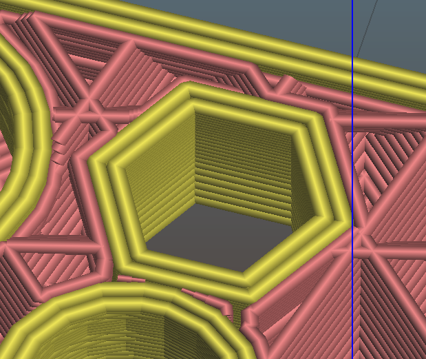
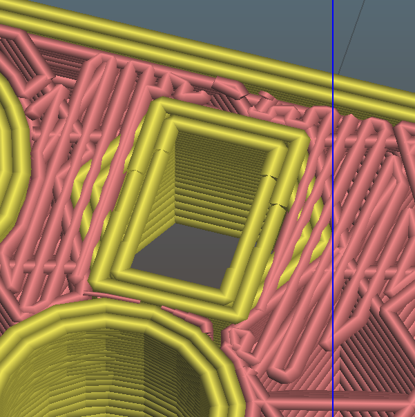
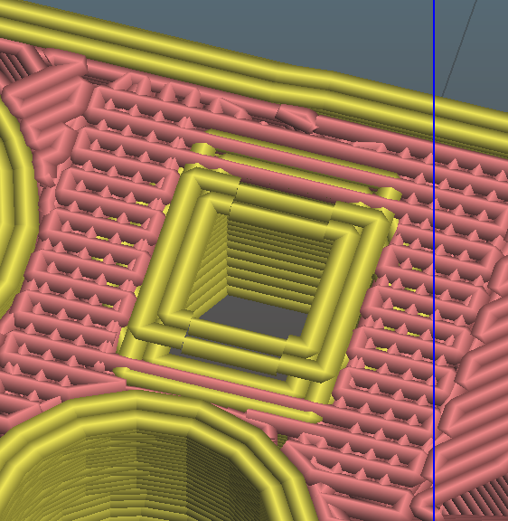
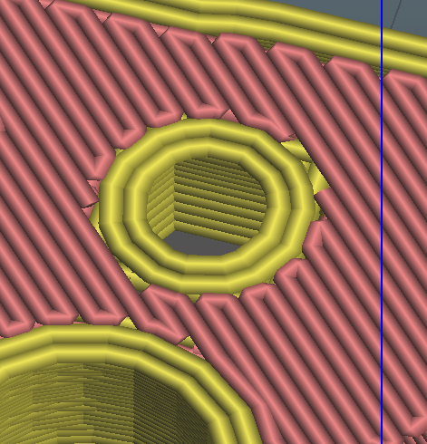

# OpenBikeSensor_pcb_case

## empfohlene Layerhöhen für easyPrint-Dateien
Alle Bereiche werden mit 0.1mm empfohlen
- Maincase: 4.8-5.6mm und 5.8-6.6mm
- Batterie-Sensor-Holder:
- OBS-D-001-V1_easyPrint: 3.6-4.3mm

## Was ist easyPrint?

Das größte Problem bei der FDM Methode des 3D-Drucks ist, dass es unmöglich ist in die Luft zu drucken. Habe ich eine Öffnung und möchte diese mit einem kleineren Loch weiter drucken bleiben mir zwei Möglichkeit. 
1. ich benutze Support. Dann wird unter den Kreis für das neue kleinere Loch eine Stützstruktur gedruckt die diesen Kreis auffängt. Nachteil dabei ist es wird mehr Material benutzt und ich muss diese Stützstruktur später entfernen.
2. ich benutze Bridging. Es wird also eine Brücke gespannt. Hat man seinen Drucker gut abgestimmt kann man gerade Abschnitt überbrücken ohne eine Stützstruktur darunter zu benötigen.

Den Fall 2 mache ich mir hier zu nutze. Da mein Loch nicht geradlinig sondern rund ist müssen ein paar Stufen eingefügt werden, die mit Brindging gedruckt werden können und ein paar Schichten später dann den eigentlichen Kreis stützen.
Zu sehen ist dieser Effekt in den nachfolgenden Bildern.

Das einzige, das jetzt zu tun bleibt, ist auf den entsprechenden höhen die Layerhöhe auf etwas unter die Höhe dieser Stufen zu reduzieren, damit diese von Slicer nicht wegapproximiert werden. Außerdem gilt, um so größer der zu stützende Kreis wird, um so mehr dieser Stufen benötige ich. Der Kreis muss also mit umso mehr Ecken angenähert werden. Für ein Loch mit 3-5mm reicht allerdings eine Näherung mit 4 Ecken vollkommen aus.
